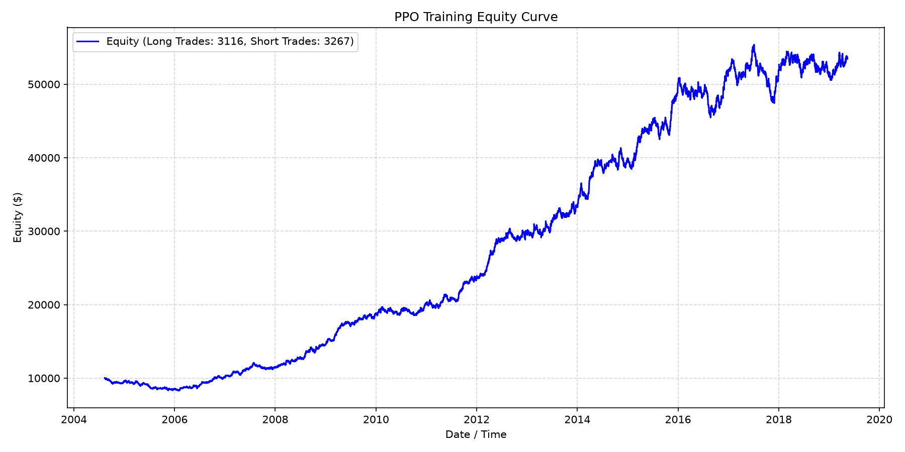
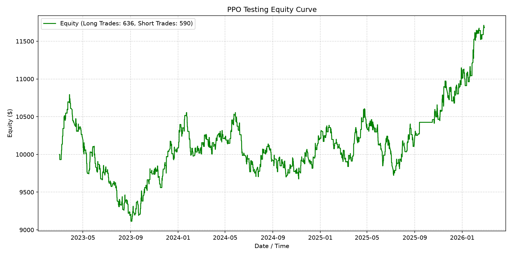
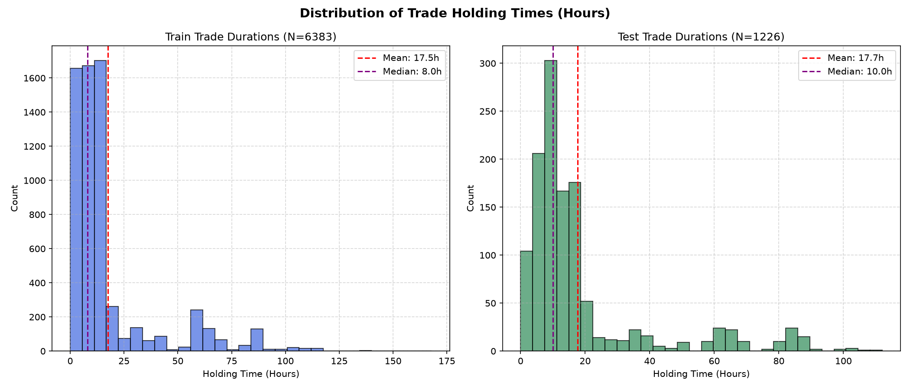

# XAUUSD Auto Trade

Eksperimen sistem automated trading untuk instrumen **XAUUSD** menggunakan reinforcement learning dengan algoritma PPO (_Proximal Policy Optimization_). Proyek ini mencakup environment simulasi, proses training dan backtesting, integrasi MetaTrader 5, REST API FastAPI, serta dashboard React untuk memantau posisi dan riwayat transaksi.

> [!WARNING]
> **Jangan gunakan akun asli atau dana nyata. Gunakan akun demo saja.** Proyek ini bersifat eksperimental dan **bukan nasihat keuangan atau rekomendasi investasi**. Trading memiliki risiko kehilangan sebagian atau seluruh modal. Model dapat menghasilkan sinyal yang salah, gagal menghadapi kondisi pasar baru, atau mengeksekusi order dengan hasil yang berbeda dari simulasi.
>
> Sebelum menjalankan kode, pastikan MetaTrader 5 terhubung ke **akun demo**, izin trading dan ukuran lot sudah diperiksa, dan sistem selalu diawasi. Pengguna bertanggung jawab penuh atas konfigurasi MetaTrader 5, kredensial akun, keputusan untuk mengaktifkan eksekusi order, serta seluruh kerugian, gangguan, atau masalah lain yang timbul dari penggunaan kode ini. Pemilik repository dan kontributor tidak menjamin profitabilitas, ketersediaan, akurasi, atau keamanan sistem.

### Video demo

<video src="https://github.com/user-attachments/assets/aac38bc7-0ba6-4b77-9803-018029225a6a" controls muted autoplay loop playsinline width="100%">
	Browser Anda tidak mendukung pemutaran video langsung. [Buka video demo](https://github.com/user-attachments/assets/aac38bc7-0ba6-4b77-9803-018029225a6a).
</video>

## Hasil training dan backtesting

Skrip `reinforcement_learning/train.py` membuat grafik berikut setelah proses training dan evaluasi selesai. Letakkan file hasilnya di `model/3/` agar gambar tampil di halaman README.

### Training equity



### Testing equity



### Trade duration



ROI training yang jauh lebih tinggi karena mencakup 19 tahun (`2004-2022`), sedangkan testing mencakup 4 tahun (`2023-2026`). Karena itu, ROI training merupakan return kumulatif dari periode dan peluang trade yang lebih banyak, sehingga tidak dapat disimpulkan kalau model overfitting.

Grafik tersebut adalah visualisasi hasil eksperimen, bukan jaminan performa masa depan. Interpretasikan bersama metrik, biaya transaksi, spread, slippage, dan kondisi data yang digunakan.

## Fitur

- Feature engineering pada data OHLCV, termasuk indikator ATR dan fitur historis.
- Environment trading berbasis Gymnasium dengan stop-loss dan take-profit otomatis.
- Training PPO dengan Stable-Baselines3 dan normalisasi observasi menggunakan `VecNormalize`.
- Evaluasi pada data training, validation, dan test yang dipisahkan berdasarkan waktu.
- Eksekusi order XAUUSD melalui MetaTrader 5 dengan stop-loss berbasis ATR multiplier (`0.5`, `0.75`, atau `1.0`) dan take-profit berbasis target R (`0.5`, `0.75`, `1.0`, atau `1.5`). Nilainya dihitung saat posisi baru dibuka berdasarkan ATR terbaru.
- Reversal otomatis: jika model memprediksi arah yang berlawanan dengan posisi aktif, posisi lama segera ditutup lalu posisi baru dibuka dengan arah dan SL/TP hasil prediksi terbaru, tanpa menunggu SL atau TP posisi lama terkena.
- Backend FastAPI untuk status posisi dan riwayat posisi yang sudah ditutup.
- Dashboard React/Vite yang melakukan refresh data secara berkala.

### Mekanisme posisi dan reversal

Model menghasilkan tiga komponen aksi: arah (`0` = flat, `1` = long, `2` = short), indeks SL, dan indeks TP. Untuk posisi baru, jarak SL dihitung sebagai `SL multiplier × ATR`, sedangkan jarak TP dihitung sebagai `TP R multiplier × jarak SL`. Pada backend, model dievaluasi setiap 3 detik. Jika hasilnya berlawanan dengan posisi aktif, sistem mencoba menutup posisi tersebut terlebih dahulu, kemudian mengirim order baru dengan volume `0.5` lot.

SL/TP adalah level perlindungan dan target yang dipasang saat order dikirim, bukan jaminan harga eksekusi. Spread, slippage, koneksi, penolakan broker, atau perubahan harga dapat menyebabkan hasil aktual berbeda dari perhitungan model.

## Arsitektur singkat

**Alur training**

```
Data CSV  →  Feature engineering  →  Trading environment  →  PPO training & backtesting
                                                                          ↓
                                                             Model (PPO + VecNormalize)
```

**Alur trading (runtime)**

```
Model  ─────────────────────────────────────────────────────────┐
                                                                 ↓
MetaTrader 5 (data harga XAUUSD)  →  FastAPI backend & trading loop  →  React dashboard
MetaTrader 5 (eksekusi order)     ←─────────────────────────────┘
```

Alur training menggunakan data CSV untuk membentuk fitur, menjalankan simulasi, melatih PPO, dan menghasilkan model. Saat mode trading dijalankan, backend memuat model tersebut, mengambil data XAUUSD dari MetaTrader 5, mengirim order berdasarkan prediksi model, dan menyediakan status posisi serta riwayat transaksi untuk dashboard.

## Persyaratan

- Windows dengan Python `>= 3.12` untuk backend.
- MetaTrader 5 desktop yang terpasang dan dapat diakses oleh package Python `MetaTrader5`.
- Node.js dan npm untuk frontend.
- Akun **demo** broker yang mendukung simbol `XAUUSD` untuk menguji integrasi. Nama simbol dapat berbeda menurut broker.

## Instalasi

Dari direktori root repository:

```powershell
python -m venv .venv
.\.venv\Scripts\Activate.ps1
python -m pip install --upgrade pip
pip install -r Requirements.txt
pip install -e .\main\backend
```

Instal dependensi frontend:

```powershell
cd main/frontend
npm install
cd ../..
```

Pastikan terminal MetaTrader 5 sudah terbuka dan **akun demo** sudah dipilih sebelum menjalankan kode yang memanggil API MT5. Jangan memasukkan kredensial akun ke source code atau repository.

## Struktur direktori

```text
.
├── data/                       # Dataset candle XAUUSD
├── main/
│   ├── backend/                # FastAPI, database, dan runner trading
│   └── frontend/               # Dashboard React/Vite
├── model/                      # Model PPO dan VecNormalize
├── notebooks/                  # Eksplorasi data dan eksperimen model
├── reinforcement_learning/    # Feature engineering, environment, training
├── main_terminal_only.py       # Runner trading terminal mandiri
├── Requirements.txt            # Dependensi utama Python
└── README.md
```
